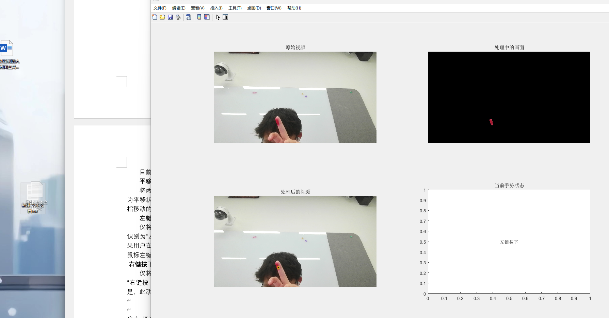
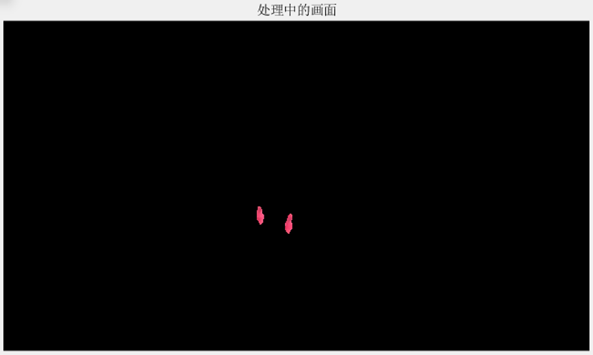

# HandMouse

   

#### 介绍
传统算法的手势识别控制鼠标方案，实现了拖拽，单击和移动的基本功能，使用Matlab制作。

   

#### 演示视频
- [https://www.bilibili.com/video/BV11x4y1J7Rf/?share_source=copy_web&vd_source=299781b2536953a17ea8da8aed51bd32](https://www.bilibili.com/video/BV11x4y1J7Rf/?vd_source=3a95dcc17122fb6cb92498ea6967feee)
